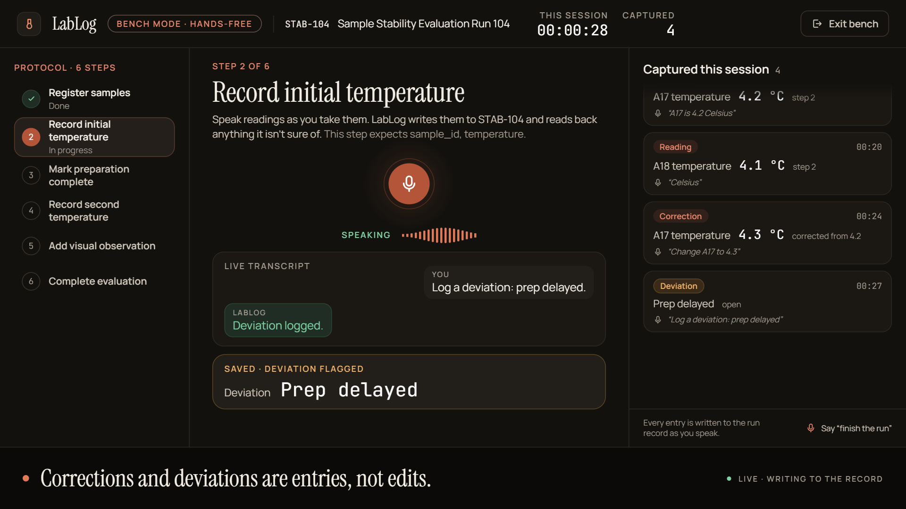
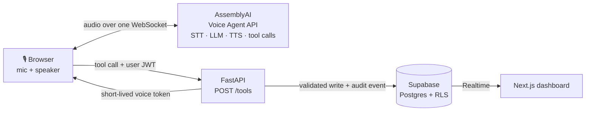

<div align="center">

# 🧪 LabLog

**Run experiments with your hands. Document them with your voice.**

A voice-native laboratory notebook. Say *"A17 is 4.2 Celsius"* and a validated,
audited measurement lands in the database and on screen, while the agent tells you
what was actually stored.

[**▶ Live demo**](https://lablog-web.vercel.app) ·
[**🎬 Demo video**](presentation.mp4) ·
[**📑 Slides (PDF)**](LabLog_Presentation%20Hackathon.pdf)




</div>

---

## The problem

Hands full. Gloves on. Timer running. And the notebook is across the room.

So the numbers wait, and the details fade: times get rounded, details get lost and
values get retyped from scraps of paper. Voice memos don't help, because nobody
turns them into a structured record.

**LabLog lets scientists say it now, while they work.** Every reading is checked,
saved and added to a structured record with history.

## What it feels like

It doesn't just transcribe. It asks, and it acts.

| You say | LabLog says | What happens |
|---|---|---|
| "A18 is 4.1." | "Is that 4.1 degrees Celsius?" | Unit missing, so **nothing is saved yet**. It asks instead of guessing. |
| "Yes." | "A18 recorded at 4.1 degrees Celsius." | `record_measurement` → validated → saved. The dashboard updates and an audit event is logged. |
| "Actually, change A17 to 4.3." | "A17 corrected to 4.3." | `correct_measurement` saves the new value and **keeps 4.2 as the previous one**. |
| "What chemical should I add next?" | "That's not in the approved protocol. Please verify first." | It answers only from the protocol and never makes up a procedure. |
| "Finish the experiment." | "Sample A19 still has no second reading." | A completeness check runs before anything is closed. |

### Three things LabLog refuses to do

- **No guessing.** "Temperature is 37" → *"Celsius or Fahrenheit?"*
- **No inventing.** Procedure questions are answered only from the approved protocol.
- **No overwriting.** A correction is a new entry, and the old value stays in the audit trail.

## Features

- 🎙️ **Hands-free voice logging.** Record measurements, observations, deviations and
  protocol steps by speaking, with live partial and final transcripts on screen.
- ✋ **Barge-in.** Talk over the agent and it stops speaking and listens.
- 🧬 **Lab vocabulary.** Measurement names, units and sample IDs are passed to speech
  recognition as key terms, so "A17" is heard as a sample and not as a word.
- 📋 **Protocol-driven runs.** Step-by-step guidance, per-step requirements, and a
  completeness check before an experiment can be finished.
- ⏱️ **Step timers.** "Start a timer for 10 minutes." When a step states a duration
  ("Centrifuge for 10 minutes"), the agent offers the timer. An audible alarm plays
  and the agent announces when the timer is up.
- 🔎 **Voice search and comparison.** "Show my PCR experiments from this week", "Which
  runs had temperature deviations?", "How does this compare with the previous run?"
- 🧾 **Full audit trail.** Every write produces an event. Corrections and deviations
  are entries, never edits.
- 🖥️ **Bench mode.** A full-screen, hands-free view of the current step, the live
  transcript and everything captured this session.
- ⚡ **Live dashboard.** Supabase Realtime pushes each saved record to every open screen.
- ✍️ **Protocol authoring.** Create and edit protocols in the UI, or dictate new steps
  during a run.

## Architecture



Each system owns one thing:

- **AssemblyAI owns the conversation:** speech recognition, turn detection, reasoning,
  tool selection, speech output and barge-in, all over one WebSocket that runs directly
  between the browser and AssemblyAI. **Audio never touches the backend.**
- **FastAPI owns the truth.** `POST /tools` is the only write path, and every call goes
  through the same pipeline:

  ```
  verify JWT → ownership check → Pydantic schema → semantic validation → write → audit event
  ```
- **Postgres owns the record.** Row-level security scopes every read to its owner, and
  Realtime pushes changes to the UI.

## Engineering highlights

The design decisions I'd point a reviewer to:

- **No agent framework, on purpose.** The reasoning loop already lives in AssemblyAI's
  LLM Gateway. The backend receives a function call and returns a row, which makes it a
  dispatcher. Wrapping that in LangGraph would add a layer and give no extra control.
- **One source of truth for tools.** The 16 tool schemas the agent sees are generated
  from the same Pydantic models that validate the calls, so the prompt and the validator
  can't drift apart. Converting to the vendor's schema format happens in a single
  function. When the format in the project's original brief turned out to be wrong,
  the fix was one line instead of 16.
- **Tools grouped per session.** A session gets one of two sets of tools: a small
  *desk* set (find, create or start an experiment) or a *bench* set (record, correct,
  advance steps, timers), capped at 12 tools. Fewer tools means fewer wrong tool choices.
- **Silence over filler.** Tools run in `hold` mode, so the agent stays quiet during a
  sub-second database write. It never speaks a line before the write has actually
  succeeded.
- **The model never does arithmetic.** Comparisons with previous runs and time-zone-aware
  date filters ("this week", "yesterday") are computed on the server. The agent reads
  back the sentence the server returns.
- **Secrets are kept out of the browser by a script.** `scripts/check-secrets.sh` fails
  if a privileged credential name appears anywhere in the frontend. The browser only
  ever receives a voice token that expires in minutes.
- **Guest mode without an auth bypass.** The public demo signs in as a real demo user,
  so every request still carries a genuine JWT and passes the same ownership checks.

## Testing and reliability

- **400+ backend tests** (pytest) covering the tool layer, validation, lifecycle,
  timers, search and completeness. They run with **no database**, against an in-memory
  fake store.
- **Frontend tests** (Vitest) for the voice client, mic readiness, timers, protocol
  forms and design tokens. A test checks the Tailwind palette against
  [`DESIGN.md`](DESIGN.md).
- **An evaluation harness that tests the agent like software.** Scripted voice
  scenarios go through the *real* system prompt, the *real* tool schemas and the *real*
  handlers: a normal reading, a missing sample, a correction, an unknown sample, an
  interruption, a procedure that isn't in the protocol, and finishing with gaps. Only a
  complete run publishes numbers to the in-app `/reliability` page, so partial results
  are never shown.

## Try the live demo

1. Open **[lablog-web.vercel.app](https://lablog-web.vercel.app)** in **Chrome or Edge**
   on a device with a microphone. You're signed in automatically as a demo user.
2. Click **Enable mic**, open the running experiment and try this script:

> "What's the current experiment?" → "A17 is 4.2 Celsius." → "A18 is 4.1." *(it asks
> for the unit)* → "Celsius." → "Note A18 looks slightly cloudy." → "Change A17 to 4.3."
> → "Log a deviation: prep delayed." → "What's next?" → "What chemical should I add
> next?" *(it declines)* → talk over the agent → "Finish the experiment." *(it lists
> what's missing)*

## Run it locally

**Prerequisites:** Python 3.11+, Node 18+, a [Supabase](https://supabase.com) project
and an [AssemblyAI](https://www.assemblyai.com) API key.

**1. Database (Supabase).** In the SQL editor, run the migrations in order:

```
supabase/migrations/0001_init.sql
supabase/migrations/0002_protocol_events.sql
supabase/migrations/0003_step_scoped_completeness.sql
```

Create a demo user (Auth → Users → Add user, with an email and a password, and tick
*Auto Confirm User*). Then run `supabase/seed.sql`, which gives that user a seeded
experiment. Running the seed again resets the demo.

**2. API (FastAPI).**

```bash
cd api
cp .env.example .env              # Supabase URL + service-role key, AssemblyAI key
pip install -r requirements.txt
uvicorn app.main:app --reload     # http://localhost:8000
pytest                            # no database needed
```

**3. Web (Next.js).**

```bash
cd web
cp .env.local.example .env.local  # Supabase URL + anon key, API URL, demo credentials
npm install
npm run dev                       # http://localhost:3000
```

Setting `NEXT_PUBLIC_DEMO_EMAIL` and `NEXT_PUBLIC_DEMO_PASSWORD` turns on guest mode.
Leave them blank to require a real login through the magic-link form at `/login`.

**4. Reliability numbers (optional).**

```bash
cd api && python -m eval.run      # writes web/public/metrics.json, shown at /reliability
```

## Deployment

Both apps deploy to Vercel's free tier as two projects from this one repository:

| Project | Root directory | Environment variables |
|---|---|---|
| Web | `web` | `NEXT_PUBLIC_SUPABASE_URL`, `NEXT_PUBLIC_SUPABASE_ANON_KEY`, `NEXT_PUBLIC_API_URL`, `NEXT_PUBLIC_APP_URL`, `NEXT_PUBLIC_DEMO_EMAIL`, `NEXT_PUBLIC_DEMO_PASSWORD` |
| API | `api` | `SUPABASE_URL`, `SUPABASE_SERVICE_ROLE_KEY`, `ASSEMBLYAI_API_KEY`, `ALLOWED_ORIGINS` |

Vercel detects FastAPI at `api/app/main.py` with no config. `ALLOWED_ORIGINS` must match
the web project's URL exactly, and `NEXT_PUBLIC_API_URL` must not end with a slash. The
API also includes a `Dockerfile` for any container host.

## Project structure

```
├── api/                 FastAPI backend: the only write path
│   ├── app/
│   │   ├── routers/     /tools, /voice/bootstrap, /protocols, /experiments, /settings
│   │   └── tools/       tool models, schema generation, handlers, prompt, timers
│   ├── eval/            scripted agent scenarios, run through the real stack
│   └── tests/           pytest suite (in-memory fake store)
├── web/                 Next.js 14 app router frontend
│   ├── app/             dashboard, experiments, bench mode, protocols, settings
│   ├── components/      voice dock, bench, timeline, sample board, timers
│   └── lib/voiceClient/ WebSocket client, 24 kHz mic pipeline, turn buffering
├── supabase/            SQL migrations and demo seed
├── scripts/             check-secrets.sh
└── DESIGN.md            visual design system
```

## Roadmap

| Now | Next | Later |
|---|---|---|
| Voice logging of readings, steps and events | Scan a barcode, then just speak | Import SOP PDFs, with a person approving them |
| Protocols, deviations, corrections | Notify teammates on Slack or email | Ingest data from instruments |
| Live dashboard and audit trail | | Integrate with existing ELN and LIMS software |
| Timers, search, run-to-run comparison | | |

**Who it's for:** biotech, pharma R&D, university, food-testing and QC labs. It works
as a voice layer on top of the lab software they already use.

## Author

Built by **Shubham Chaudhari** ([@shubhamchaudhari08](https://github.com/shubhamchaudhari08))
for a hackathon.

<sub>Say it. Log it. Trust it.</sub>
